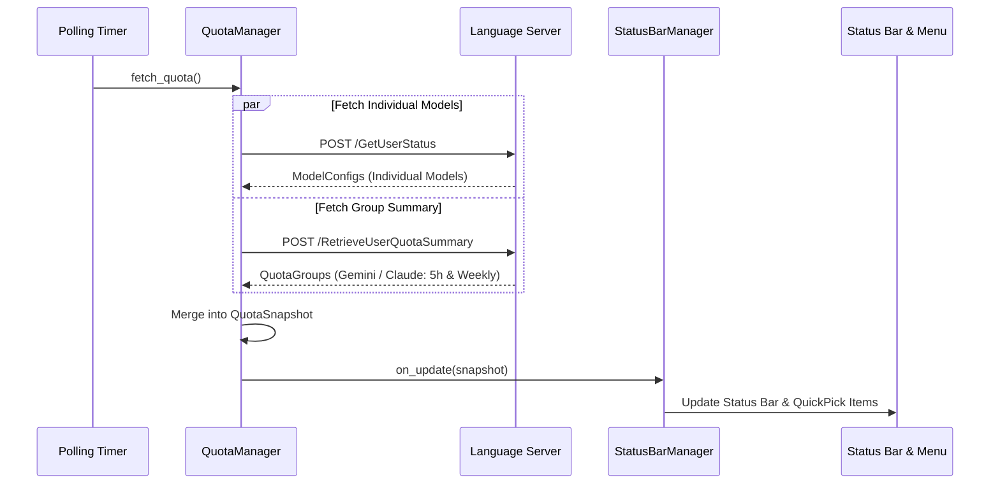

# Proposal 001: モデルグループ別クォータ（5h / 1w リミット）の取得と表示

- **作成日**: 2026-10-03
- **ステータス**: Draft (In Review)
- **対象コンポーネント**: `src/utils/types.ts`, `src/core/quota_manager.ts`, `src/ui/status_bar.ts`, `src/core/config_manager.ts`, `package.json`
- **関連 Issue / PR**: (本家提出予定)

---

## 1. 背景と課題 (Background & Problem Statement)

### 1.1 背景 (Context)
Antigravity Quota (AGQ) は、ローカルで稼働する Antigravity 言語サーバーと通信し、AI モデルのクォータ残量およびリセット時間を VS Code のステータスバー等に表示する拡張機能です。

### 1.2 課題・問題点 (Problem Statement)
- **単一リミットしか見えない問題**:
  現状の AGQ は `/exa.language_server_pb.LanguageServerService/GetUserStatus` API を使用してモデル一覧（`clientModelConfigs`）を取得しています。しかし、この API で返される各モデルの `quotaInfo` には、直近で有効な 1 つのリミット（Gemini 系は 5 時間リミットのみ、Claude 系は 1 週間リミットのみ）しか含まれていません。
- **IDE 本体との表示乖離**:
  Antigravity IDE 本体の設定画面（**Setting - Models**）では、Gemini や Claude に対して **「Weekly Limit Remaining」** と **「Five Hour Limit Remaining」** の両方が明確に表示されています。
- **ユーザー体験の不足**:
  Google AI Pro 等のプランを利用するユーザーにとって、直近の「5時間バースト制限」だけでなく、「今週あとどれくらい使えるか（1週間リミット）」を把握することは作業ペース配分上極めて重要ですが、現在の AGQ ではこれを確認する手段がありません。

---

## 2. 調査結果・技術検証 (Investigation & Findings)

### 2.1 調査対象・エンドポイント
Antigravity 言語サーバーバイナリ（`language_server_windows_x64.exe`）の解析およびローカルプロセスへのリクエスト検証により、クォータ詳細を取得する専用エンドポイント **`RetrieveUserQuotaSummary`** が存在することを確認しました。

- **Endpoint**: `POST /exa.language_server_pb.LanguageServerService/RetrieveUserQuotaSummary`
- **Headers**:
  - `Content-Type: application/json`
  - `Connect-Protocol-Version: 1`
  - `X-Codeium-Csrf-Token: <CSRF_TOKEN>`
- **Request Body**:
  ```json
  {
    "metadata": {
      "ideName": "antigravity",
      "extensionName": "antigravity",
      "locale": "en"
    }
  }
  ```

### 2.2 実際の取得データ（検証済み）
実際にローカル環境で返却された完全な JSON レスポンス構造：

```json
{
  "response": {
    "groups": [
      {
        "displayName": "Gemini Models",
        "description": "Models within this group: Gemini Flash, Gemini Pro",
        "buckets": [
          {
            "bucketId": "gemini-weekly",
            "displayName": "Weekly Limit Remaining",
            "description": "You have used some of your weekly limit, it will fully refresh in 3 days, 19 hours.",
            "window": "weekly",
            "remainingFraction": 0.84122616,
            "resetTime": "2026-10-07T03:18:39Z"
          },
          {
            "bucketId": "gemini-5h",
            "displayName": "Five Hour Limit Remaining",
            "description": "You have used some of your 5-hour limit, it will fully refresh in 4 hours, 42 minutes.",
            "window": "5h",
            "remainingFraction": 0.9561114,
            "resetTime": "2026-10-03T12:35:53Z"
          }
        ]
      },
      {
        "displayName": "Claude and GPT models",
        "description": "Models within this group: Claude Opus, Claude Sonnet, GPT-OSS",
        "buckets": [
          {
            "bucketId": "3p-weekly",
            "displayName": "Weekly Limit Remaining",
            "window": "weekly",
            "remainingFraction": 1.0,
            "resetTime": "2026-10-10T07:53:32Z"
          },
          {
            "bucketId": "3p-5h",
            "displayName": "Five Hour Limit Remaining",
            "window": "5h",
            "remainingFraction": 1.0,
            "resetTime": "2026-10-03T12:53:32Z"
          }
        ]
      }
    ],
    "description": "Within each group, models share a weekly limit and a 5-hour limit..."
  }
}
```

### 2.3 技術的なポイント
1. クォータは個別モデルごとではなく、「**Gemini Models グループ**」および「**Claude and GPT models グループ**」というグループ単位で共有されていることが仕様として明記されています。
2. 各グループには `weekly` と `5h` の 2 つの `buckets` が常に存在し、それぞれの `remainingFraction`（残量割合）と `resetTime`（リセット時刻）が正確に取得可能です。

---

## 3. 提案内容・機能仕様 (Proposed Solution & Architecture)

### 3.1 概要 (Overview)
`QuotaManager` において、従来の `GetUserStatus` に加えて（または併用して）`RetrieveUserQuotaSummary` を呼び出し、グループクォータ情報（5h / 1w）を取得・管理します。
ステータスバーおよび QuickPick メニューにおいて、これらのグループ単位の残量を視覚的に表示できるようにします。

### 3.2 アーキテクチャとデータフロー



### 3.3 UI / UX 仕様 (UI Specifications)

#### ① プラン差分への動的適応設計（Data-Driven Bucket Rendering）
ユーザーの契約プラン（Free / Plus / Pro / Ultra / Enterprise 等）によって、返却される `buckets` や `groups` の内容は変動します（例: 1w リミットがなく 5h のみ存在するプラン、Claude グループが利用不可のプランなど）。
そのため、コード内で「5h と 1w が必ず存在する」といったハードコードは行わず、**サーバーから返却された `buckets` 配列を動的に走査・描画する設計** とします。

#### ② クイックピックメニュー（`agq.show_menu`）
メニュー上部に **「Quota Groups (Shared Limits)」** セクションを追加します。存在するバケットの数に応じて柔軟にプログレスバーを生成します。

```
---------------------------------------------------------------------
Quota Groups (Shared Limits)
---------------------------------------------------------------------
  Gemini Models (Flash, Pro)
    [▓▓▓▓▓▓▓▓▓░] 95.6%  5-Hour Limit   Resets in: 4h 42m (12:35)
    [▓▓▓▓▓▓▓▓░░] 84.1%  Weekly Limit   Resets in: 3d 19h (10/07 03:18)
    ※ 1w リミットがないプランでは 5-Hour Limit の 1 行のみが自然に表示される

  Claude & GPT Models (Sonnet, Opus, GPT-OSS)
    [▓▓▓▓▓▓▓▓▓▓] 100%   Weekly Limit   Resets in: 6d 23h (10/10 07:53)
    [▓▓▓▓▓▓▓▓▓▓] 100%   5-Hour Limit   Ready

---------------------------------------------------------------------
Model Quotas (Toggle Pin)
---------------------------------------------------------------------
  ✓ $(check) Gemini 3.8 Flash (Low)     [▓▓▓▓▓▓▓▓▓░] 95.6%
    $(check) Claude Sonnet 5.5 (Medium) [▓▓▓▓▓▓▓▓▓▓] 100%
```

#### ③ ステータスバー表示
ユーザーがグループクォータをステータスバーで一目で確認できるように、設定により以下のいずれかを選択可能にします：
- **パターン A (デフォルト互換)**: ピン留めされた個別モデルを表示（従来通り）。
- **パターン B (グループ表示モード)**:
  返却されたバケット数に応じて動的に文字列を構成します：
  - **5h と 1w の両方がある場合 (Pro 等)**:
    `$(check) Gemini [5h: 96% | 1w: 84%]  $(check) Claude [1w: 100%]`
  - **5h のみの場合 (Plus / 一部プラン等)**:
    `$(check) Gemini [5h: 96%]`
  - **1w のみの場合**:
    `$(check) Claude [1w: 100%]`
  ※ ステータスアイコンは、存在するバケットのうち最も残量が低いものを基準に `$(check)` / `$(warning)` / `$(error)` を自動判定。

### 3.4 設定項目 (`package.json`)

| 設定キー | 型 | デフォルト値 | 説明 |
| :--- | :---: | :---: | :--- |
| `agq.displayMode` | `string` (enum) | `"models"` | ステータスバーの表示モード。<br>- `"models"`: 従来通りピン留めモデルを表示<br>- `"groups"`: Gemini/Claude グループの残量をコンパクト表示（存在するリミットを自動判別）<br>- `"both"`: グループとピン留めモデルの両方を表示 |
| `agq.pinnedGroups` | `string[]` | `["gemini-models", "claude-gpt-models"]` | 表示対象のグループ ID 一覧 |

---

## 4. 実装計画・モジュール別変更点 (Implementation Plan)

- [ ] **1. 型定義の拡張 (`src/utils/types.ts`)**:
  - `quota_bucket_info` (`bucketId`, `displayName`, `window`, `remainingFraction`, `remainingPercentage`, `resetTime`, etc.) の定義。
  - `quota_group_info` (`displayName`, `description`, `buckets: quota_bucket_info[]`) の定義。
  - `quota_snapshot` に `groups?: quota_group_info[]` を追加。
- [ ] **2. データ取得の統合 (`src/core/quota_manager.ts`)**:
  - `fetch_quota()` で `GetUserStatus` と並行して `RetrieveUserQuotaSummary` を呼び出し（`Promise.allSettled` による堅牢な並行リクエスト）。
  - `RetrieveUserQuotaSummary` が失敗または空の場合でも、既存のモデル個別表示は維持できるようフォールバック設計。
- [ ] **3. UI の拡張 (`src/ui/status_bar.ts`)**:
  - `build_menu_items()` にグループ別の表示セクションを追加（バケット数に応じた動的ループ描画）。
  - `agq.displayMode` 設定に応じたステータスバーテキストの生成ロジックを追加（1w なしのプランでもスマートに 5h のみを描画）。
- [ ] **4. 設定管理の更新 (`src/core/config_manager.ts` & `package.json`)**:
  - `agq.displayMode` などの設定読み込みとリアルタイム変更検知の対応。
- [ ] **5. 品質検証**:
  - `npm run compile`（TypeScript コンパイル通過）
  - `node .agents/scripts/check-no-japanese.mjs --all`（英語厳守チェック通過）
  - 実際の Antigravity IDE 環境での動作確認。

---

## 5. 下位互換性とリスク (Backward Compatibility & Risks)

- **下位互換性の確保**:
  - 既存の `agq.pinnedModels` やモデル個別表示のロジックはそのまま維持し、初期設定では既存ユーザーの体験を壊さないように配慮します。
- **プラン差異（Google AI Free / Plus / Pro / Enterprise）への適応**:
  - 1w リミットが存在しないプランや、特定グループが存在しないプランでも、返却されたバケットのみを動的に描画するため、UI の崩れや未定義エラーは発生しません。
- **古い/異なる環境でのフォールバック**:
  - 万が一言語サーバーが `RetrieveUserQuotaSummary` をサポートしていない古いバージョン等の場合、HTTP 404 / 501 / 403 エラーをキャッチして既存の `GetUserStatus` のみで静かにフォールバック動作させます。

---

## 6. 本家（upstream）向け PR / Issue ドラフト (English Draft for Upstream)

### Title
```
feat: support weekly and 5-hour quota groups via RetrieveUserQuotaSummary
```

### Description
```markdown
## Summary
This PR adds support for retrieving and displaying both **5-Hour** and **Weekly** quota limits for model groups (Gemini Models, Claude & GPT Models), matching the detailed quota view found in Antigravity's native "Settings > Models" page.

## Motivation & Problem
Currently, AGQ fetches quota data solely through `GetUserStatus`. However, that endpoint only exposes a single active quota window per individual model (e.g., only the 5-hour window for Gemini models, and only the 1-week window for Claude models).

Users on Google AI Pro and other tiers have both a 5-hour burst limit and a weekly aggregate limit. Users frequently check Antigravity's native Settings to inspect both numbers. Exposing both limits directly in the status bar and interactive menu provides much greater visibility and convenience.

## Changes & Implementation
1. **Endpoint Integration**: Integrated the `/exa.language_server_pb.LanguageServerService/RetrieveUserQuotaSummary` endpoint in `QuotaManager`.
2. **Type Definitions**: Added `quota_group_info` and `quota_bucket_info` interfaces to `src/utils/types.ts`.
3. **Adaptive Bucket Rendering**:
   - The UI does not hardcode limits; instead, it dynamically adapts to whichever buckets are returned for the user's tier (e.g. displaying only `5h` if `weekly` is absent, or both `5h` and `1w` if present).
4. **Interactive Menu (QuickPick)**:
   - Added a new "Quota Groups (Shared Limits)" section at the top of the menu displaying progress bars and time-until-reset for both 5-hour and weekly limits.
5. **Status Bar Display Options**:
   - Added `agq.displayMode` configuration (`"models"`, `"groups"`, or `"both"`), allowing users to display group-level 5h/1w limits directly in the status bar.
6. **Graceful Fallback**: If `RetrieveUserQuotaSummary` fails (e.g. on older language server builds or unsupported tiers), the extension seamlessly falls back to individual model tracking without breaking.

## Verification
- Successfully tested against the live Antigravity language server process.
- Verified TypeScript compilation (`npm run compile`).
- Verified status bar toggling, menu interaction, and time formatting for both `5h` and `weekly` windows.
```
