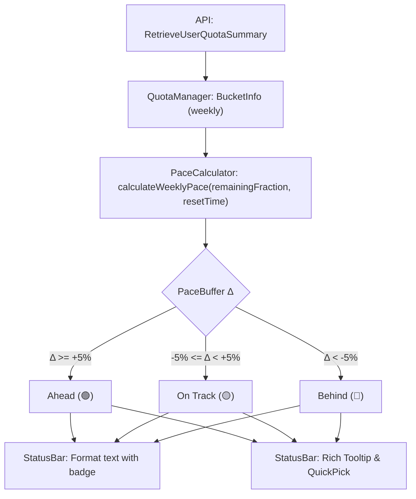

# Proposal 002: Weekly Quota Pace Indicator (週間クォータ・ペースインジケーター)

- **作成日**: 2026-10-04
- **ステータス**: In Review
- **対象コンポーネント**: `src/core/*`, `src/ui/*`, `src/utils/*`, `package.json`
- **関連 Issue / PR**: Proposal 001 (#28 共有グループクォータ表示)

---

## 1. 背景と課題 (Background & Problem Statement)

### 1.1 背景 (Context)
Proposal 001 により、Antigravity Quota (AGQ) は 5時間枠（`5h`）と週間枠（`weekly`）の両方の共有クォータ制限を取得・表示できるようになりました。これにより、Claude や GPT などのモデルグループが抱える週間制限の現在残量（例: `80%`）とリセット日時が可視化されています。

### 1.2 課題・問題点 (Problem Statement)
しかし、週間枠（168時間サイクル）の残量パーセンテージだけを見ても、**「今のペースで使っていて週末やリセット日まで持つのか？」** を直感的に判断できません。

1. **枯渇時の致命的な業務停止リスク**:
   - 5時間枠は一時的に使い切っても数時間待てば当日中に回復します。
   - 一方、週間枠を週の前半〜中盤（火曜〜木曜など）で使い切ってしまうと、**数日間にわたり Claude や 高性能モデルが一切使えなくなる** という深刻な事態に陥ります。
2. **手動計算の認知負荷**:
   - 「今週は今日で3日目が終わる（残り4日＝約57%）。現在の残量は 80% だから、80% > 57% でまだ余裕があるな」といった計算をユーザーが頭の中で毎回行う必要があり、不便です。
3. **視覚的なペース警告の欠如**:
   - ステータスバー上で一目で「今週は使いすぎ（Behind）か、適正（On Track）か、余裕がある（Ahead）か」が分かるバッジやインジケーターが求められています。

---

## 2. 調査結果・技術検証 (Investigation & Findings)

### 2.1 週間リセット時刻と計算モデル
`/RetrieveUserQuotaSummary` のレスポンスに含まれる `quota_bucket_info` から、週間枠のリセット時刻（`resetTime`：Unix タイムスタンプ秒）が取得可能です。

```json
{
  "label": "weekly",
  "remainingFraction": 0.8,
  "resetTime": 1743900000
}
```

- **全サイクル期間 ($T_{total}$)**: 7日間 = 168時間 = $604,800$ 秒
- **リセットまでの残り秒数 ($T_{remain}$)**: $\max(0, \text{resetTime} - \text{now})$
- **残り時間の割合 ($R_{time}$)**: $\min(1.0, \frac{T_{remain}}{604800})$
- **理想目標残量 ($\text{Target Quota}$)**: $R_{time} \times 100\%$

#### ペースバッファ差分 ($\Delta$)
$$\Delta = \text{現在の残量(\%)} - \text{Target Quota(\%)}$$

| バッファ差分 ($\Delta$) | ステータス | 絵文字バッジ | 意味・ユーザーへの示唆 |
| :--- | :--- | :---: | :--- |
| **$+5\%$ 以上** | **Ahead (余裕あり)** | 🟢 | リニア消費ペースより節約できており、リセットまで十分に余裕がある |
| **$-5\% \sim +5\%$** | **On Track (適正)** | 🟡 | ほぼ理想ペース通り。このままの配分で使えばちょうどリセットを迎える |
| **$-5\%$ 未満** | **Behind (使いすぎ・枯渇リスク)** | 🔴 | 消費が早すぎる。このままだとリセット前に枯渇する危険がある |

> **例**: 7日間のうち3日経過（残り4日 = 57.1% の時間残量）。
> - 現在残量が **80%** の場合: $\Delta = 80\% - 57.1\% = +22.9\%$ ➔ **🟢 Ahead (+23%)**
> - 現在残量が **45%** の場合: $\Delta = 45\% - 57.1\% = -12.1\%$ ➔ **🔴 Behind (-12%)**

### 2.2 ステータスバーにおける絵文字カラーバッジの実現性
VS Code のステータスバー（`StatusBarItem.text`）は、標準の Unicode 絵文字（`🟢`, `🟡`, `🔴`）をネイティブの OS 絵文字フォント（Segoe UI Emoji / Apple Color Emoji）を用いて **フルカラーで直接描画** できます。
追加の CSS やテーマ依存がなく、軽量かつ確実にカラー識別を提供できます。

---

## 3. 提案内容・機能仕様 (Proposed Solution & Architecture)

### 3.1 概要 (Overview)
週間クォータバケットを持つモデルグループ（およびモデル）に対して、理想消費ペースとの比較を行い、**ステータスバー上に絵文字カラーバッジ（🟢/🟡/🔴）** を表示します。
さらに、ツールチップおよび QuickPick メニューにて詳細なペース診断情報（目標残量、バッファ率）を提供します。

### 3.2 アーキテクチャとデータフロー



### 3.3 UI / UX 仕様

#### A. ステータスバー表示 (Status Bar)
週間クォータが存在する項目に絵文字バッジを付与します：

- **グループ表示モード (`agq.displayMode: "groups"`)**:
  - `Gemini: 95% | Claude: 80%🟢`
  - 使いすぎ時: `Gemini: 95% | Claude: 35%🔴`
- **モデル個別表示モード (`agq.displayMode: "models"`)**:
  - `Claude 3.7: 80%🟢`
- ※ 週間枠を持たない項目（例: 5時間枠のみの Gemini）にはバッジを付けず、ノイズを抑制します。

#### B. ツールチップ (Hover Tooltip)
ホバー時に、計算の内訳と安心材料を提供：

```text
Claude / GPT Models
• 5h:  95% (Resets in 2h 15m)
• 1w:  80% (Resets in 3d 22h)
  Pace: 🟢 Ahead of pace (+23% buffer)
  Target Quota: 57% (Linear consumption)
```

#### C. クイックピックメニュー (Interactive QuickPick)
クリック時のメニューでも、1w バケットの横に状態を表示：

```text
Claude and GPT models (Claude/GPT) [5h: 95% | 1w: 80% 🟢 Ahead]
  5h:  [███████████████████░] 95% (Resets in 2h 15m)
  1w:  [████████████████░░░░] 80% 🟢 Ahead (+23%) (Resets in 3d 22h)
```

### 3.4 設定項目 (Configuration Options)

`package.json` に以下の設定を追加します：

| キー | 型 | 初期値 | 説明 |
| :--- | :--- | :--- | :--- |
| `agq.showWeeklyPaceIndicator` | `boolean` | `true` | ステータスバーやメニューに週間クォータの消費ペースインジケーター（🟢/🟡/🔴）を表示するかどうか。 |

---

## 4. 実装計画・モジュール別変更点 (Implementation Plan)

- [ ] **型定義の更新 (`src/utils/types.ts`)**:
  - `PaceStatus` (`"ahead" | "on_track" | "behind"`) の定義。
  - `WeeklyPaceInfo`（`status`, `emoji`, `bufferPercentage`, `targetQuotaPercentage`）の追加。
- [ ] **ペース計算モジュール (`src/core/pace_calculator.ts`)**:
  - `calculateWeeklyPace(remainingFraction: number, resetTimeSeconds: number, nowSeconds?: number): WeeklyPaceInfo | null` の実装。
  - ゼロ除算・リセット経過後のクランプ処理を網羅。
- [ ] **UI 表示の更新 (`src/ui/status_bar.ts`)**:
  - ステータスバー項目のフォーマット時に、対象モデル/グループが 1w バケットを持つ場合に絵文字バッジを付与。
  - ツールチップにペース詳細行を追加。
  - QuickPick メニューの行にペース状態を反映。
- [ ] **設定管理 (`src/core/config_manager.ts` & `package.json`)**:
  - `showWeeklyPaceIndicator` のスキーマ定義とローダー実装。
- [ ] **単体テスト (`test/pace_calculator.test.mjs`)**:
  - 様々な残り時間と残量パーセントにおける判定テスト（境界値: +5%, -5%, 0%, 100%）。
  - リセット期限切れ時のフォールバックテスト。
- [ ] **品質検証**:
  - `npm run compile`
  - `npm run test`
  - `node .agents/scripts/check-no-japanese.mjs --all`
  - `node .agents/scripts/check-branch-isolation.mjs`

---

## 5. 下位互換性とリスク (Backward Compatibility & Risks)

- **完全なオプトアウト可能**:
  - 絵文字が不要なユーザーは `agq.showWeeklyPaceIndicator: false` で従来のシンプルなパーセント表示に戻せます。
- **データ不在時の安全なフォールバック**:
  - `weekly` バケットが存在しない場合や `resetTime` が取得できない場合は、ペース計算をスキップして従来通りパーセントのみを描画します。
- **軽量性**:
  - 純粋な算術計算（減算と除算）のみで完結するため、ポーリング時のオーバーヘッドは極小（< 0.1ms）です。

---

## 6. 本家（upstream）向け PR ドラフト (English Draft for Upstream)

### Title
```
feat: add weekly quota pace indicator with color status badges
```

### Description
```markdown
## Summary
This PR introduces an intelligent **Weekly Quota Pace Indicator** to Antigravity Quota (AGQ).
By comparing the current remaining quota with the expected linear burn-rate based on remaining time in the 7-day cycle, AGQ displays visual status emoji badges (`🟢`, `🟡`, `🔴`) on the status bar, tooltip, and QuickPick menu.

## Motivation & Problem
While viewing the raw remaining percentage (e.g. `Claude: 80%`) is helpful, it doesn't answer the developer's critical question:
**"Am I using quota at a safe pace, or will I run out before the week ends?"**

- **High-impact risk**: Running out of 5-hour quota is temporary (resets in hours), but exhausting a 7-day weekly quota locks developers out of Claude / premium models for days.
- **Cognitive load**: Developers currently have to mentally calculate their pace (e.g., "Day 3 of 7 has passed = 57% time left, I have 80% quota left, so I am safe").

## Solution & Implementation Details
1. **Pace Calculation Model**:
   - Calculates target linear quota from `resetTime`: $\text{Target} = \frac{T_{remain}}{168\text{h}} \times 100\%$
   - Calculates buffer: $\Delta = \text{Current Quota} - \text{Target}$
   - Status categorization:
     - 🟢 **Ahead of pace** ($\Delta \ge +5\%$): Safe with surplus buffer
     - 🟡 **On track** ($-5\% \le \Delta < +5\%$): Well balanced
     - 🔴 **Behind pace** ($\Delta < -5\%$): Burning quota too fast, risk of exhaustion before reset
2. **Status Bar Badges**:
   - Renders native Unicode color emojis (`🟢`, `🟡`, `🔴`) directly in the status bar (e.g., `Claude: 80%🟢`).
   - Automatically scopes only to items with a `weekly` bucket (avoids cluttering 5h-only models like Gemini).
3. **Rich Tooltip & QuickPick Breakdown**:
   - Displays exact buffer percentage and target linear quota in hover tooltips and interactive menu items.
4. **Customization**:
   - New setting `agq.showWeeklyPaceIndicator` (default: `true`) to allow instant opt-out.
5. **Zero External Dependencies & Unit Tests**:
   - Built-in mathematical calculation with comprehensive boundary test coverage (`node:test`).

## Verification
- Unit tests covering boundary values (+5%, -5%, clamped times, expired timestamps).
- Verified on Windows x64 with Antigravity Language Server.
- Seamless toggle with `agq.showWeeklyPaceIndicator`.
```
