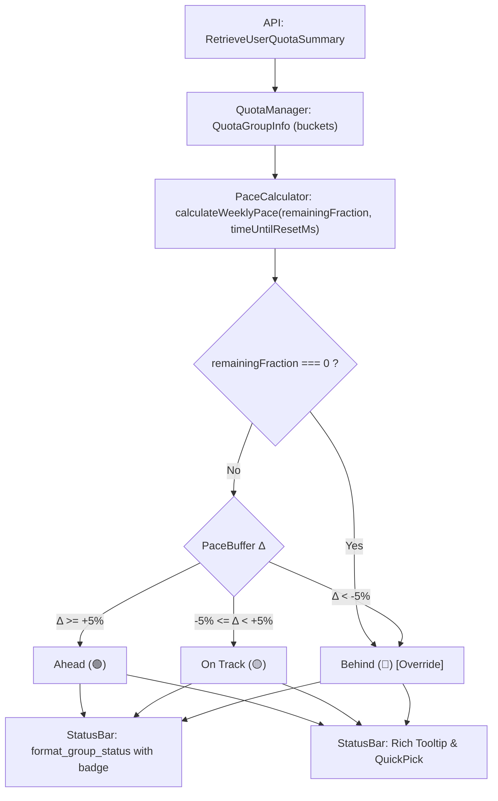

# Proposal 002: Weekly Quota Pace Indicator (週間クォータ・ペースインジケーター)

- **作成日**: 2026-10-04 (改定: 2026-10-05)
- **ステータス**: In Review
- **対象コンポーネント**: `src/core/*`, `src/ui/*`, `src/utils/*`, `package.json`
- **関連 Issue / PR**: Proposal 001 (#28 共有グループクォータ表示)

---

## 1. 背景と課題 (Background & Problem Statement)

### 1.1 背景 (Context)
Proposal 001 により、Antigravity Quota (AGQ) は 5時間枠（`5h`）と週間枠（`weekly`）の両方の共有クォータ制限を取得・表示できるようになりました。これにより、Claude や GPT などのモデルグループが抱える週間制限の現在残量（例: `80%`）とリセット日時が可視化されています。

### 1.2 課題・問題点 (Problem Statement)
しかし、週間枠（168時間サイクル）の残量パーセンテージだけを見ても、**「今のペースで使っていて週末やリセット日まで持つのか？」** を直感的に判断できません。

1. **枯渇時の致命的な業務停止リスク**:
   - 5時間枠は一時的に使い切っても数時間待てば当日中に回復します。
   - 一方、週間枠を週の前半〜中盤（火曜〜木曜など）で使い切ってしまうと、**数日間にわたり Claude や 高性能モデルが一切使えなくなる** という深刻な事態に陥ります。
2. **手動計算の認知負荷**:
   - 「今週は今日で3日目が終わる（残り4日＝約57%）。現在の残量は 80% だから、80% > 57% でまだ余裕があるな」といった計算をユーザーが頭の中で毎回行う必要があり、不便です。
3. **視覚的なペース警告の欠如**:
   - ステータスバー上で一目で「今週は使いすぎ（Behind）か、適正（On Track）か、余裕がある（Ahead）か」が分かるバッジやインジケーターが求められています。

---

## 2. 調査結果・技術検証 (Investigation & Findings)

### 2.1 週間リセット時刻と計算モデル
`/RetrieveUserQuotaSummary` のレスポンスに含まれる `quota_bucket_info` から、週間枠のリセット時刻（`reset_time: Date`）および残り時間（`time_until_reset: number` [ms]）が取得可能です。

```json
{
  "label": "weekly",
  "remainingFraction": 0.8,
  "resetTime": "2026-10-12T00:00:00Z"
}
```

- **全サイクル期間 ($T_{total}$)**: 7日間 = 168時間 = $604,800,000$ ミリ秒
- **リセットまでの残りミリ秒 ($T_{remain}$)**: $\max(0, \text{time\_until\_reset})$
- **残り時間の割合 ($R_{time}$)**: $\min(1.0, \frac{T_{remain}}{604800000})$
- **理想目標残量 ($\text{Target Quota}$)**: $R_{time} \times 100\%$

#### ペースバッファ差分 ($\Delta$)
$$\Delta = \text{現在の残量(\%)} - \text{Target Quota(\%)}$$

| バッファ差分 ($\Delta$) | ステータス | 絵文字バッジ | 意味・ユーザーへの示唆 |
| :--- | :--- | :---: | :--- |
| **$+5\%$ 以上** | **Ahead (余裕あり)** | 🟢 | リニア消費ペースより節約できており、リセットまで十分に余裕がある |
| **$-5\% \sim +5\%$** | **On Track (適正)** | 🟡 | ほぼ理想ペース通り。このままの配分で使えばちょうどリセットを迎える |
| **$-5\%$ 未満** | **Behind (使いすぎ・枯渇リスク)** | 🔴 | 消費が早すぎる。このままだとリセット前に枯渇する危険がある |

> **例**: 7日間のうち3日経過（残り4日 = 57.1% の時間残量）。
> - 現在残量が **80%** の場合: $\Delta = 80\% - 57.1\% = +22.9\%$ ➔ **🟢 Ahead (+23%)**
> - 現在残量が **45%** の場合: $\Delta = 45\% - 57.1\% = -12.1\%$ ➔ **🔴 Behind (-12%)**

#### エッジケースと優先オーバーライド規則 (Edge Cases & Override Guards)
1. **完全枯渇時のオーバーライドガード (Exhausted Override Guard)**:
   - サイクル終盤（例: 残り時間 1%＝約1.7時間前）で残量が 0% の場合、$\text{Target Quota} = 1\%$ となり、$\Delta = 0\% - 1\% = -1\%$ となります。
   - 単純な $\pm 5\%$ の判定では「🟡 On Track」と誤判定されるため、**`remaining_fraction === 0` または `is_exhausted === true` の場合は無条件で `🔴 Behind`（または枯渇状態）にオーバーライド** します。
2. **リセット時刻超過時 (`time_until_reset <= 0`)**:
   - サーバーのリセット反映遅延等でリセット時刻を過ぎた場合は、$T_{remain} = 0$, $\text{Target Quota} = 0\%$ にクランプします。残量がまだ 0 の場合は反映待ち（Pending Reset）として扱い、負数によるバグを防ぎます。
3. **サイクル開始直後 ($T_{remain} \ge T_{total}$)**:
   - $R_{time} > 1.0$ とならないよう $\min(1.0, \dots)$ で確実にクランプします。

### 2.2 ステータスバーにおける絵文字カラーバッジの実現性
VS Code のステータスバー（`StatusBarItem.text`）は、標準の Unicode 絵文字（`🟢`, `🟡`, `🔴`）をネイティブの OS 絵文字フォント（Segoe UI Emoji / Apple Color Emoji）を用いて **フルカラーで直接描画** できます。追加の CSS やテーマ依存がなく、軽量かつ確実にカラー識別を提供できます。

---

## 3. 提案内容・機能仕様 (Proposed Solution & Architecture)

### 3.1 概要 (Overview)
週間クォータバケットを持つモデルグループに対して、理想消費ペースとの比較を行い、**ステータスバー上に絵文字カラーバッジ（🟢/🟡/🔴）** を表示します。
さらに、新設するリッチツールチップおよび QuickPick メニューにて詳細なペース診断情報（目標残量、バッファ率）を提供します。

### 3.2 アーキテクチャとデータフロー



### 3.3 UI / UX 仕様

#### A. ステータスバー表示 (Status Bar)
Proposal 001 の現行フォーマット（`$(check) ShortName [5h: xx% | 1w: yy%]`）に準拠し、`1w`（weekly）バケットのパーセント直後に絵文字バッジを付与します：

- **グループ表示モード (`agq.displayMode: "groups"` または `"both"`)**:
  - 順調・余裕時: `$(check) Claude/GPT [5h: 95% | 1w: 80%🟢]`
  - ペース超過・使いすぎ時: `$(check) Claude/GPT [5h: 95% | 1w: 35%🔴]`
  - 週間枠を持たないグループ（例: 5時間枠のみの Gemini）: `$(check) Gemini [5h: 90%]`（バッジなしでノイズ抑制）
- **左端アイコンと絵文字の役割分担**:
  - **左端 Codicon (`$(check)`, `$(warning)`, `$(error)`)**: グループ全体の「現在の最小残量」による緊急度（<20% で警告、0% でエラー）。
  - **右端絵文字 (`🟢`, `🟡`, `🔴`)**: 週間バケットの「時間経過に対する消費ペース健全性」。
- **モデル個別表示モード (`agq.displayMode: "models"`) での扱い**:
  - API の個別モデル定義（`GetUserStatus.clientModelConfigs`）には 5時間枠の `quota_info` のみが返され、`weekly` バケットが存在しないため、個別モデル行にはバッジを付与しません（グループ表示時のみに限定）。

#### B. ツールチップ (Hover Tooltip - 新設)
現在固定文字列（`'Click to view Antigravity Quota details'`）となっているステータスバーツールチップを、`vscode.MarkdownString` による動的リッチツールチップに刷新します：

```markdown
### Antigravity Quota Details

**Claude and GPT models (Claude/GPT)**
• **5-Hour**: 95% (Resets in 2h 15m)
• **Weekly**: 80% 🟢 **Ahead of pace** (+23% buffer)
  - Target Quota: 57% (Linear consumption)
  - Resets in: 3d 22h

*Click to open quota menu*
```

#### C. クイックピックメニュー (Interactive QuickPick)
クリック時のメニューにおいて、Child Bucket（1w）の行にペース診断とバッファ率を分かりやすく表示します：

```text
Quota Groups (Toggle Pin)
  $(check) Claude and GPT models
      Weekly: [████████░░] 80.0% 🟢 Ahead (+23%)   (Resets in: 3d 22h)
      5-Hour: [█████████░] 95.0%                     (Resets in: 2h 15m)
```

### 3.4 設定項目 (Configuration Options)

`package.json` に以下の設定を追加します：

| キー | 型 | 初期値 | 説明 |
| :--- | :--- | :--- | :--- |
| `agq.showWeeklyPaceIndicator` | `boolean` | `true` | ステータスバーやメニューに週間クォータの消費ペースインジケーター（🟢/🟡/🔴）を表示するかどうか。 |

---

## 4. 実装計画・モジュール別変更点 (Implementation Plan)

- [ ] **型定義の更新 (`src/utils/types.ts`)**:
  - `PaceStatus` (`'ahead' | 'on_track' | 'behind'`) の定義。
  - `WeeklyPaceInfo`（`status`, `emoji`, `bufferPercentage`, `targetQuotaPercentage`）の追加。
- [ ] **ペース計算モジュール (`src/core/pace_calculator.ts`) の新設**:
  - `calculateWeeklyPace(remainingFraction: number | undefined, timeUntilResetMs: number): WeeklyPaceInfo | null` の実装。
  - サイクル期間定数（`WEEKLY_CYCLE_MS = 7 * 24 * 60 * 60 * 1000`）。
  - 完全枯渇時の `remainingFraction === 0` ガードおよび時間クランプ処理の実装。
- [ ] **ステータスバー描画の更新 (`src/ui/status_bar.ts`)**:
  - `format_group_status` に `show_pace_indicator: boolean` 引数を追加し、`weekly` バケットに絵文字を付与。
  - `build_tooltip(snapshot: quota_snapshot): vscode.MarkdownString` を新設し、動的リッチツールチップを生成。
  - `build_menu_items` の Weekly 子アイテム行にペース情報（バッジ＋バッファ率）を反映。
- [ ] **設定管理 (`src/core/config_manager.ts` & `package.json`)**:
  - `agq.showWeeklyPaceIndicator` のスキーマ定義とローダー実装。
  - `config_options` インターフェースの更新。
- [ ] **単体テスト (`test/pace_calculator.test.mjs`)**:
  - 境界値テスト（$\Delta = +5\%, -5\%, 0\%$）。
  - エッジケーステスト（残量 0% の終盤枯渇ガード、残り時間 0 のリセット超過クランプ、未定義時のフォールバック）。
- [ ] **品質検証**:
  - `npm run compile`
  - `npm run test`
  - `node .agents/scripts/check-no-japanese.mjs --all`
  - `node .agents/scripts/check-branch-isolation.mjs`

---

## 5. 下位互換性とリスク (Backward Compatibility & Risks)

- **完全なオプトアウト可能**:
  - 絵文字が不要なユーザーは `agq.showWeeklyPaceIndicator: false` で従来のシンプルなパーセント表示に戻せます。
- **データ不在時の安全なフォールバック**:
  - `weekly` バケットが存在しない場合や `remaining_fraction` が取得できない場合は、ペース計算をスキップして従来通りパーセントのみを描画します。
- **軽量性**:
  - 純粋な算術計算（ミリ秒の減算と除算）のみで完結するため、ポーリング時のオーバーヘッドは極小（< 0.1ms）です。

---

## 6. 本家（upstream）向け PR ドラフト (English Draft for Upstream)

### Title
```
feat: add weekly quota pace indicator with color status badges
```

### Description
```markdown
## Summary
This PR introduces an intelligent **Weekly Quota Pace Indicator** to Antigravity Quota (AGQ).
By comparing the current remaining quota with the expected linear burn-rate based on remaining time in the 7-day cycle, AGQ displays visual status emoji badges (`🟢`, `🟡`, `🔴`) on the status bar, rich hover tooltip, and QuickPick menu.

## Motivation & Problem
While viewing the raw remaining percentage (e.g. `Claude/GPT [1w: 80%]`) is helpful, it doesn't answer the developer's critical question:
**"Am I using quota at a safe pace, or will I run out before the week ends?"**

- **High-impact risk**: Running out of a 5-hour quota is temporary (resets in hours), but exhausting a 7-day weekly quota locks developers out of Claude / premium models for multiple days.
- **Cognitive load**: Developers currently have to mentally calculate their pace (e.g., "Day 3 of 7 has passed = 57% time left, I have 80% quota left, so I am safe").

## Solution & Implementation Details
1. **Pace Calculation Model & Edge Case Guards**:
   - Calculates target linear quota from remaining time in the 168-hour cycle: $\text{Target} = \frac{T_{remain}}{168\text{h}} \times 100\%$
   - Calculates pace buffer: $\Delta = \text{Current Quota} - \text{Target}$
   - Status categorization:
     - 🟢 **Ahead of pace** ($\Delta \ge +5\%$): Safe with surplus buffer
     - 🟡 **On track** ($-5\% \le \Delta < +5\%$): Well balanced
     - 🔴 **Behind pace** ($\Delta < -5\%$): Burning quota too fast, risk of exhaustion before reset
   - **Exhaustion Guard**: If remaining fraction is 0%, status is immediately overridden to Behind (`🔴`), preventing false "On Track" results near cycle end.
2. **Status Bar Badges**:
   - Renders native Unicode color emojis (`🟢`, `🟡`, `🔴`) directly in the status bar (e.g., `$(check) Claude/GPT [5h: 95% | 1w: 80%🟢]`).
   - Scoped specifically to `weekly` buckets (5h-only groups like Gemini remain clean without badges).
3. **Rich Tooltip & QuickPick Breakdown**:
   - Upgrades status bar tooltip to a dynamic `MarkdownString` showing detailed quota breakdowns and linear targets.
   - Enhances QuickPick weekly bucket rows with emoji badge and buffer percentage.
4. **Customization**:
   - New setting `agq.showWeeklyPaceIndicator` (default: `true`) to allow instant opt-out.
5. **Zero External Dependencies & Comprehensive Unit Tests**:
   - Built-in mathematical calculation with comprehensive boundary and edge-case test coverage (`node:test`).

## Verification
- Unit tests covering boundary values (+5%, -5%, clamped times, expired timestamps, zero-remaining guard).
- Verified on Windows x64 with Antigravity Language Server.
- Seamless toggle with `agq.showWeeklyPaceIndicator`.
```

